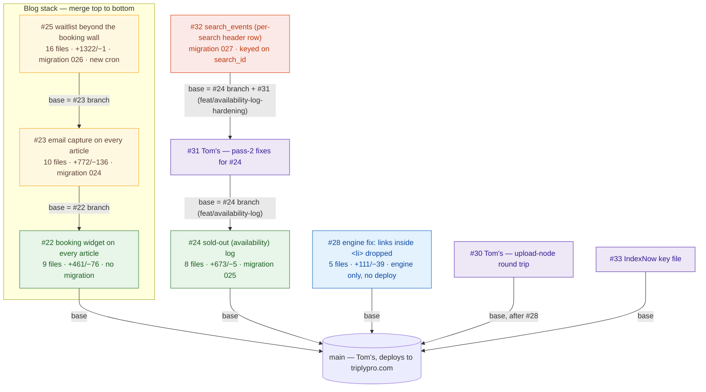
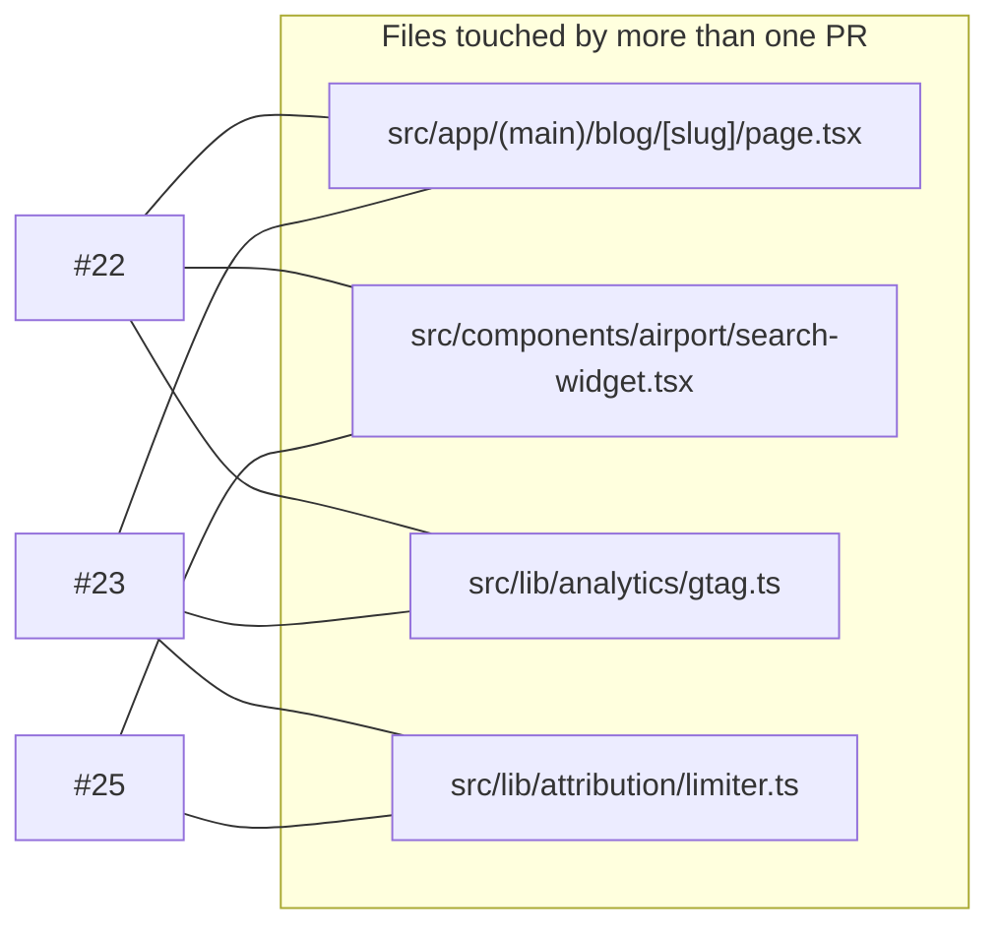

# Code-review graph — open PRs, in OODA order

**What this is:** one page that shows every open PR, what it depends on, which files overlap, and the exact
order to merge — so a review takes minutes, not a re-read of five diffs. Pure documentation: nothing in
`docs/` is imported, built, linted or deployed. Delete the file and nothing changes.

**How to use it (OODA):** *Observe* the graph → *Orient* on the overlaps and migrations → *Decide* the order →
*Act* with the per-PR checklist. Update the graph when a PR is opened or merged; it is the scaffold, the PR
bodies carry the detail.

Status as of **23 Sep 2026** — pass-3 review landed on #22/#23/#25/#32 and pass-3 fixes are applied and
rebased (stack top vitest 537/537); #28 has been approved since 22 Sep and is still unmerged; #30 and #31
(both Tom's) and #33 have been reviewed with no blocking findings. Maintained by Vin; Tom merges.

---

## 1 · Observe — the graph



Green = can merge now. Amber = stacked; GitHub retargets the base to `main` automatically once the PR
below it merges. Blue = blog-engine code only (a local CLI — Vercel never runs it). Purple = Tom's PRs (or
#33) reviewed by Vin with no blocking findings. Orange = holding on purpose — #32 is rebased onto #24+#31
and waits for that branch to merge before it can.

**Review status (21 Sep reviews → 22 Sep fixes):**

| PR | Tom's verdict 21 Sep | 22 Sep fix |
|---|---|---|
| #28 | one fix (reports/ dir) | fixed, `npm test` added to the engine |
| #22 | two asks (lazy-load picker, tests) | both done + the four optional items (enabled gate, `<p>` not `<h2>`, GA4 `blog_cta_click`, `not-prose` dropped) |
| #23 | blocked (migration collision, false "code on its way") | renumbered 024; existing subscribers get an honest message or a fresh code; first-touch attribution; origin/rate-limit/body guards; 7 tests |
| #25 | blocked (email cannon, promise nothing sends, no date bound, two-timezone boundary) | all four blockers + should-fixes: guards + per-email send cap, `waitlist-notify` cron actually sends the opens-on email, 730-day bound, `/api/booking-window` as the single source of truth, unsubscribe route + `List-Unsubscribe`, prompt behind a "Traveling further out?" link; 41 tests |
| #24 | three fixes before the first row | build-time guard + `env` column, `source` in the rollup, immutable day index + pg_cron retention, plus items 4–10 and the Lows (`search_id`, nullable `sold_out`, `grand_total_cents`, tests) |

**Pass-3 review (23 Sep) — fixes applied same day:**

| PR | Tom's pass-3 verdict | Fixed in |
|---|---|---|
| #22 | 1 High (fallback date inputs uncapped → 422s, noise on TRIPLY-13) + 3 Mediums | `a5d304e` — date bounds from `booking-window.ts`'s `getFallbackDateBounds()`, `ChunkLoadError`-specific error boundary branch, one first-half bound for the article-split candidates, `Sentry.captureMessage` on the RichText insert fallback |
| #23 | 2 High (welcome-email failure = permanent lockout; limiter no longer bounds requests) | `bff9aba` + `f9c6fff` (rebased onto the new #22) — `stampWelcomeSentAt` only after a confirmed send with a resend path; 60/min/IP request-tier limiter (`checkNewsletterRequestRateLimit`) ahead of the 15/min mint quota; `promo/validate` gated through `isPromoCodeUsable`; orphaned promo codes deleted on write-failure paths |
| #25 | `next build` fails without `WAITLIST_SIGNING_SECRET` (verified locally) + 2 High (poison rows starve the queue; 50-row cap silent) | `b98001b` (rebased onto the new #22/#23) — secret read moved into the signing helpers so a missing var 500s at request time instead of failing the build; `notify_attempts`/`last_notify_error` cap poison rows at 5 attempts; separate unfiltered backlog alarm; unsubscribe route case-insensitive lookup |
| #32 | 2 Critical / 6 High standalone; design ask: hold behind #24/#31 and rebase as the per-search header row | `a977539` — rebased onto `feat/availability-log-hardening` (#31), reworked `search_events` as a per-search header row written from inside `searchParking`, keyed on `search_id` shared with the `availability_log` rows; migration 027 |
| #33 | — (approved) | no changes needed |

#28 has been approved since 22 Sep and is still unmerged — Tom, please merge whenever. #30 (Tom's, upload-node
round trip into `main`) and #31 (Tom's, pass-2 fixes for #24) were reviewed by Vin with no blocking findings;
#31 gets one non-blocking nit (`writerNotes()` should gate its "`/api/search` isn't reaching the logger" message
on the request actually expecting `search` rows). Stack top (through #32): vitest 537/537.

## 2 · Orient — where the PRs touch the same files



- All four overlaps are **inside the stack**, in stack order — already resolved on the branches; merging
  #22 → #23 → #25 is conflict-free.
- #23 lifts `isSameOrigin`/`clientKey` out of `/api/attribution` into `src/lib/http/origin.ts` and turns the
  attribution limiter into a `createBoundedRateLimiter` factory. `/api/attribution` behaviour and tests are
  unchanged; `/api/newsletter` and (in #25) `/api/waitlist` reuse both.
- #24 touches `src/lib/reslab/search.ts` and `src/app/api/chat/route.ts` (Tom's area). It inserts a log
  call **before** the sold-out filter, now inside its own `try/catch`, with a kill switch
  (`AVAILABILITY_LOG_DISABLED=1` — flip **and redeploy**; Vercel env changes don't reach running
  deployments) and a `next build` no-op guard.
- #28 touches only `scripts/blog-engine/` — cannot collide with app code.

**New shared code added in the pass-3 round (23 Sep), for the next overlap check:** `checkNewsletterRequestRateLimit`
(the request-tier limiter, `src/lib/attribution/limiter.ts` — #23) — `isPromoCodeUsable`, now also gating
`promo/validate` (#23) — `readAttributionFromRequest(req, { surface })`, used by `/api/search` to suppress the
checkout-step report on search calls (#32) — `src/lib/search-events/log.ts`, the new writer alongside
`availability/log.ts` (#32) — `FakeSupabase` now supports `.delete()` and a real `.order()` (#23, #32). None of
these show up as cross-PR overlaps yet since #23 and #32 don't share files directly, but check them again once
#32 is off hold.

**Migrations, in order:** `024_newsletter_source` (with #23) → `025_availability_log` (with #24) →
`026_booking_waitlist` (with #25) → `027_search_events` (with #32). All additive (new columns / new tables / a
view); none rewrites data. `023_booking_attribution` is Tom's, on `main`, applied to prod 17 Sep — that is why
the rest were renumbered. Apply each one **by hand to the shared Supabase before its deploy**; every route
degrades to a no-op or an honest error until its migration exists, so the order is safe either way but the
feature is dark until applied.

## 3 · Decide — the order

| Step | Merge | Then | Why this order |
|---|---|---|---|
| 1 | **#28** | nothing to deploy | Independent, smallest, has a test that fails on `main` — a 3-minute review; approved since 22 Sep |
| 2 | **#30** | Vercel deploys | Tom's, independent of the stack, reviewed with no findings; **hold the bulk blog-engine `update-links` run until this merges** |
| 3 | **#24** (with #31 merged into it first) | migration **025** first, then deploy | #31 is #24's own pass-2 fixes; land them together so `feat/availability-log` ships hardened. Every day unmerged is a day of peak-season availability history not recorded |
| 4 | **#22** | Vercel deploys | Base of the blog stack; gives every article its first route to a booking |
| 5 | **#23** | migration **024** first, then deploy | Retargets to `main` after #22; the email card needs the widget's layout |
| 6 | **#25** | migration **026** first, then deploy; confirm the new cron appears in Vercel; **`WAITLIST_SIGNING_SECRET` must exist in Vercel Preview + Production before this merges** | Retargets after #23; reuses the guards #23 introduced |
| 7 | **#32** | migration **027** first, then deploy | Rebased onto #24+#31 as the per-search header row — can't merge before step 3 lands |
| 8 | this doc | — | last, so it lands describing a merged stack |

#33 (IndexNow key file) is approved and independent — merge whenever, no ordering constraint.

## 4 · Act — the checklist per PR

| PR | Verify before merge | Verify after deploy |
|---|---|---|
| #28 | `cd scripts/blog-engine && npm test` → 4 pass; `npx tsc --noEmit -p .` clean | — |
| #22 | `npm run build && npm test`; on any `/blog/<slug>` preview → widget at top, CTA ~30% down, opening the date picker loads a separate chunk (Network tab) | Same on triplypro.com; `blog_cta_click` events appear in GA4 DebugView |
| #23 | build + test; on preview submit the card → `newsletter_subscribers` row with `source='blog'`, email with a 10% code; submit again → "already on the list" message, no second email | Apply **024** first, then check the row carries `airport_code`/`page` |
| #25 | build + test; confirm `WAITLIST_SIGNING_SECRET` is set in Preview + Production (its absence now 500s at request time rather than failing the build); on preview click "Traveling further out?" → prompt, pick a date past the wall, submit → `booking_waitlist` row + confirmation email with an unsubscribe link; `curl -H "Authorization: Bearer $CRON_SECRET" /api/cron/waitlist-notify` → `{ sent: 0 }` | Apply **026** first; `vercel.json` now has a 13:00 UTC `waitlist-notify` cron — check it shows in the Vercel Crons tab; `WAITLIST_SIGNING_SECRET` signs unsubscribe links |
| #24 | build + test (with #31 merged in first); one search on preview → rows in `availability_log` with `env='preview'`; `GET /api/admin/availability` responds | Apply **025** first; within an hour run `SELECT source, env, count(*) FROM availability_log GROUP BY 1,2` — `search` rows with `env='production'` must appear, or `/api/search` isn't reaching the logger; confirm `AVAILABILITY_LOG_DISABLED` is unset |
| #32 | build + test; rebased onto #24+#31 — merge only after step 3; one search on preview → matching `search_events` header row and `availability_log` lot rows share the same `search_id` | Apply **027** first; confirm `SEARCH_EVENTS_LOG_DISABLED` is unset; check `search_events_writer_health` view for write failures |

Repo rules that apply to all of them are in `CLAUDE.md` (build + test before merge; `/scoped-review` for
customer-facing changes; delete the branch after merge).

**Known, not in these PRs:** `MAX_ADVANCE_BOOKING_DAYS` is still 60 in `src/lib/booking-window.ts` while
ResLab has accepted 100 days since 17 Sep. Raising that one constant moves both date pickers and the
waitlist threshold together, because #25 makes the server the single source of truth.

---

### Keeping this page current

Add a node when a PR opens, move it to a "merged" note when it lands, re-check the overlap graph with:

```bash
gh pr list --state open --json number,files --jq '.[] | "\(.number) \(.files[].path)"' | sort -k2 | uniq -D -f1
```

(prints any file that appears in more than one open PR).
