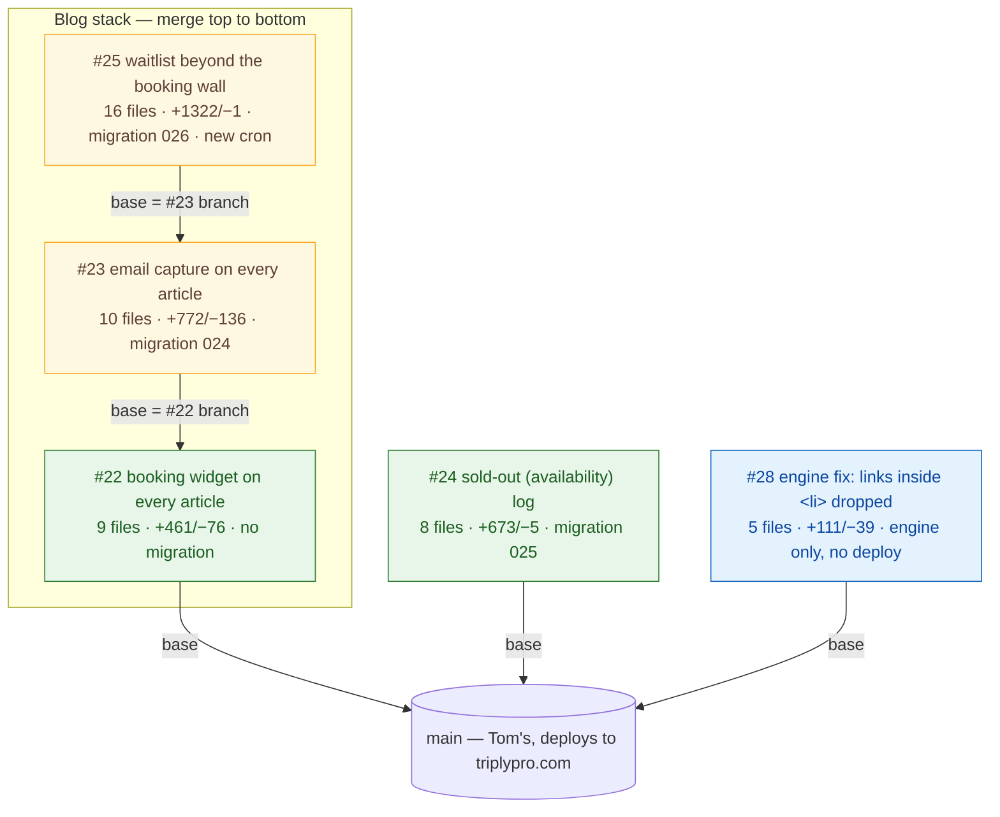
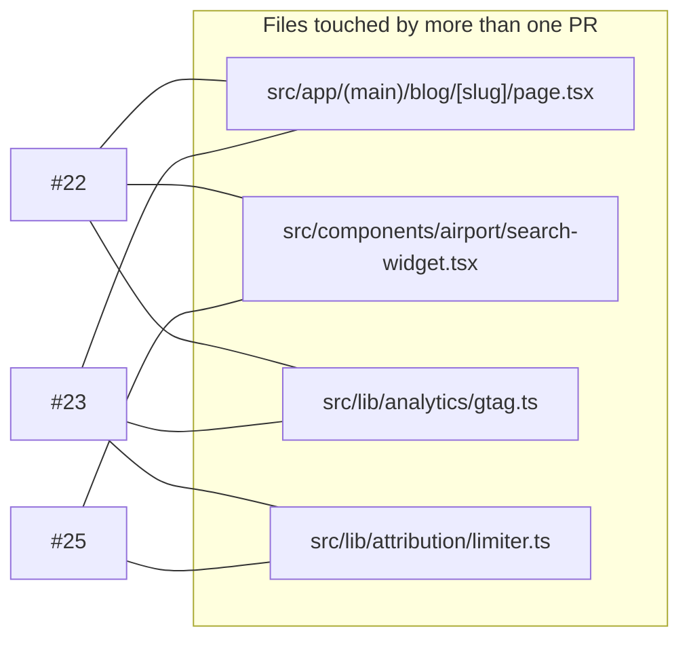

# Code-review graph — open PRs, in OODA order

**What this is:** one page that shows every open PR, what it depends on, which files overlap, and the exact
order to merge — so a review takes minutes, not a re-read of five diffs. Pure documentation: nothing in
`docs/` is imported, built, linted or deployed. Delete the file and nothing changes.

**How to use it (OODA):** *Observe* the graph → *Orient* on the overlaps and migrations → *Decide* the order →
*Act* with the per-PR checklist. Update the graph when a PR is opened or merged; it is the scaffold, the PR
bodies carry the detail.

Status as of **22 Sep 2026** — every PR below has had Tom's 21 Sep review applied, is rebased on that day's
`main`, and builds + passes tests on the merged tree. Maintained by Vin; Tom merges.

---

## 1 · Observe — the graph



Green = can merge now. Amber = stacked; GitHub retargets the base to `main` automatically once the PR
below it merges. Blue = blog-engine code only (a local CLI — Vercel never runs it).

**Review status (21 Sep reviews → 22 Sep fixes):**

| PR | Tom's verdict 21 Sep | Now |
|---|---|---|
| #28 | one fix (reports/ dir) | fixed, `npm test` added to the engine |
| #22 | two asks (lazy-load picker, tests) | both done + the four optional items (enabled gate, `<p>` not `<h2>`, GA4 `blog_cta_click`, `not-prose` dropped) |
| #23 | blocked (migration collision, false "code on its way") | renumbered 024; existing subscribers get an honest message or a fresh code; first-touch attribution; origin/rate-limit/body guards; 7 tests |
| #25 | blocked (email cannon, promise nothing sends, no date bound, two-timezone boundary) | all four blockers + should-fixes: guards + per-email send cap, `waitlist-notify` cron actually sends the opens-on email, 730-day bound, `/api/booking-window` as the single source of truth, unsubscribe route + `List-Unsubscribe`, prompt behind a "Traveling further out?" link; 41 tests |
| #24 | three fixes before the first row | build-time guard + `env` column, `source` in the rollup, immutable day index + pg_cron retention, plus items 4–10 and the Lows (`search_id`, nullable `sold_out`, `grand_total_cents`, tests) |

## 2 · Orient — where the PRs touch the same files



- All four overlaps are **inside the stack**, in stack order — already resolved on the branches; merging
  #22 → #23 → #25 is conflict-free.
- #23 lifts `isSameOrigin`/`clientKey` out of `/api/attribution` into `src/lib/http/origin.ts` and turns the
  attribution limiter into a `createBoundedRateLimiter` factory. `/api/attribution` behaviour and tests are
  unchanged; `/api/newsletter` and (in #25) `/api/waitlist` reuse both.
- #24 touches `src/lib/reslab/search.ts` and `src/app/api/chat/route.ts` (Tom's area). It inserts a log
  call **before** the sold-out filter, now inside its own `try/catch`, with a kill switch
  (`AVAILABILITY_LOG_DISABLED=1` — flip **and redeploy**; Vercel env changes don't reach running
  deployments) and a `next build` no-op guard.
- #28 touches only `scripts/blog-engine/` — cannot collide with app code.

**Migrations, in order:** `024_newsletter_source` (with #23) → `025_availability_log` (with #24) →
`026_booking_waitlist` (with #25). All additive (new columns / new tables / a view); none rewrites data.
`023_booking_attribution` is Tom's, on `main`, applied to prod 17 Sep — that is why the three were renumbered.
Apply each one **by hand to the shared Supabase before its deploy**; every route degrades to a no-op or an
honest error until its migration exists, so the order is safe either way but the feature is dark until applied.

## 3 · Decide — the order

| Step | Merge | Then | Why this order |
|---|---|---|---|
| 1 | **#28** | nothing to deploy | Independent, smallest, has a test that fails on `main` — a 3-minute review |
| 2 | **#22** | Vercel deploys | Base of the stack; gives every article its first route to a booking |
| 3 | **#23** | migration **024** first, then deploy | Retargets to `main` after #22; the email card needs the widget's layout |
| 4 | **#25** | migration **026** first, then deploy; confirm the new cron appears in Vercel | Retargets after #23; reuses the guards #23 introduced |
| 5 | **#24** | migration **025** first, then deploy | Independent of the stack — can go any time; every day unmerged is a day of peak-season availability history not recorded |
| 6 | this doc | — | last, so it lands describing a merged stack |

## 4 · Act — the checklist per PR

| PR | Verify before merge | Verify after deploy |
|---|---|---|
| #28 | `cd scripts/blog-engine && npm test` → 4 pass; `npx tsc --noEmit -p .` clean | — |
| #22 | `npm run build && npm test`; on any `/blog/<slug>` preview → widget at top, CTA ~30% down, opening the date picker loads a separate chunk (Network tab) | Same on triplypro.com; `blog_cta_click` events appear in GA4 DebugView |
| #23 | build + test; on preview submit the card → `newsletter_subscribers` row with `source='blog'`, email with a 10% code; submit again → "already on the list" message, no second email | Apply **024** first, then check the row carries `airport_code`/`page` |
| #25 | build + test; on preview click "Traveling further out?" → prompt, pick a date past the wall, submit → `booking_waitlist` row + confirmation email with an unsubscribe link; `curl -H "Authorization: Bearer $CRON_SECRET" /api/cron/waitlist-notify` → `{ sent: 0 }` | Apply **026** first; `vercel.json` now has a 13:00 UTC `waitlist-notify` cron — check it shows in the Vercel Crons tab; `PAYLOAD_SECRET` must be set (signs unsubscribe links) |
| #24 | build + test; one search on preview → rows in `availability_log` with `env='preview'`; `GET /api/admin/availability` responds | Apply **025** first; within an hour run `SELECT source, env, count(*) FROM availability_log GROUP BY 1,2` — `search` rows with `env='production'` must appear, or `/api/search` isn't reaching the logger; confirm `AVAILABILITY_LOG_DISABLED` is unset |

Repo rules that apply to all of them are in `CLAUDE.md` (build + test before merge; `/scoped-review` for
customer-facing changes; delete the branch after merge).

**Known, not in these PRs:** `MAX_ADVANCE_BOOKING_DAYS` is still 60 in `src/lib/booking-window.ts` while
ResLab has accepted 100 days since 17 Sep. Raising that one constant moves both date pickers and the
waitlist threshold together, because #25 makes the server the single source of truth.

---

### Keeping this page current

Add a node when a PR opens, move it to a "merged" note when it lands, re-check the overlap graph with:

```bash
gh pr list --state open --json number,files --jq '.[] | "\(.number) \(.files[].path)"' | sort -k2 | uniq -D -f1
```

(prints any file that appears in more than one open PR).
