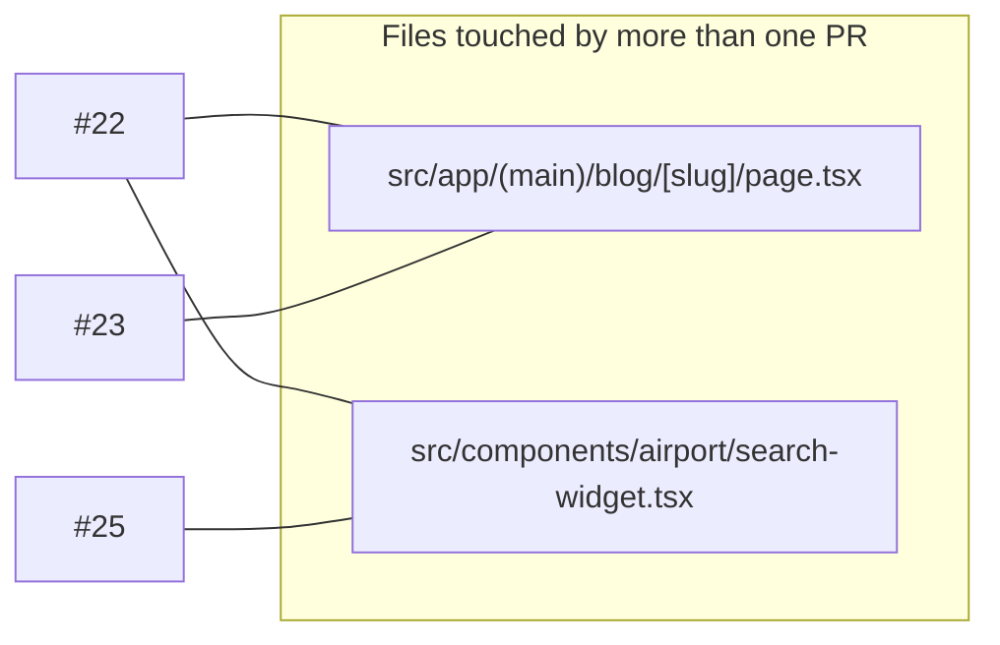

# Code-review graph — open PRs, in OODA order

**What this is:** one page that shows every open PR, what it depends on, which files overlap, and the exact
order to merge — so a review takes minutes, not a re-read of five diffs. Pure documentation: nothing in
`docs/` is imported, built, linted or deployed. Delete the file and nothing changes.

**How to use it (OODA):** *Observe* the graph → *Orient* on the overlaps and migrations → *Decide* the order →
*Act* with the per-PR checklist. Update the graph when a PR is opened or merged; it is the scaffold, the PR
bodies carry the detail.

Status as of **19 Sep 2026**. Maintained by Vin; Tom merges.

---

## 1 · Observe — the graph


Green = can merge now. Amber = stacked; GitHub retargets the base to `main` automatically once the PR
below it merges. Blue = blog-engine code only (a local CLI — Vercel never runs it).

## 2 · Orient — where the PRs touch the same files



- Both overlaps are **inside the stack**, in stack order — no conflict if merged #22 → #23 → #25.
- #24 touches `src/lib/reslab/search.ts` and `src/app/api/chat/route.ts` (Tom's area). It inserts a log
  call **before** the sold-out filter and nothing else in the search path; the log has a kill switch
  (`AVAILABILITY_LOG_DISABLED=1`).
- #28 touches only `scripts/blog-engine/src/` — cannot collide with app code.

**Migrations, in order:** `023_newsletter_source` (with #23) → `024_availability_log` (with #24) →
`025_booking_waitlist` (with #25). All additive (new columns / new tables / a view); none rewrites data.
Numbers were chosen after Tom's 021/022 (ParkGuard tiers), so there is no collision.

## 3 · Decide — the order

| Step | Merge | Then | Why this order |
|---|---|---|---|
| 1 | **#28** | nothing to deploy | Independent, smallest, has a test that fails on `main` — a 3-minute review |
| 2 | **#22** | Vercel deploys | Base of the stack; gives every article its first route to a booking |
| 3 | **#23** | run migration 023 | Retargets to `main` after #22; the email card needs the widget's layout |
| 4 | **#25** | run migration 025 | Retargets after #23; reuses the capture component |
| 5 | **#24** | run migration 024 | Independent of the stack — can go any time; every day unmerged is a day of peak-season availability history not recorded |

## 4 · Act — the checklist per PR

| PR | Verify before merge | Verify after deploy |
|---|---|---|
| #28 | `cd scripts/blog-engine && npm ci && npx tsx --test src/html-to-lexical.test.ts` → pass 4 | — |
| #22 | `npm run build && npm test`; open the preview URL on any `/blog/<slug>` → widget renders ~30% down, CTA still at the end | Same on triplypro.com |
| #23 | build + test; on preview, submit the card → one `newsletter` row with `source='blog'`, email arrives with a 10% code | Run migration 023 first, then check the row carries `airport_code`/`page` |
| #25 | build + test; on preview pick a date past the booking wall → prompt appears, submit → `booking_waitlist` row | Migration 025 first |
| #24 | build + test; one search on preview → rows in `availability_log`; `GET /api/admin/availability` responds | Migration 024 first; confirm `AVAILABILITY_LOG_DISABLED` is unset in Vercel env |

Repo rules that apply to all of them are in `CLAUDE.md` (build + test before merge; `/scoped-review` for
customer-facing changes; delete the branch after merge).

---

### Keeping this page current

Add a node when a PR opens, move it to a "merged" note when it lands, re-check the overlap graph with:

```bash
gh pr list --state open --json number,files --jq '.[] | "\(.number) \(.files[].path)"' | sort -k2 | uniq -D -f1
```

(prints any file that appears in more than one open PR).
